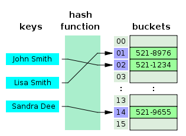
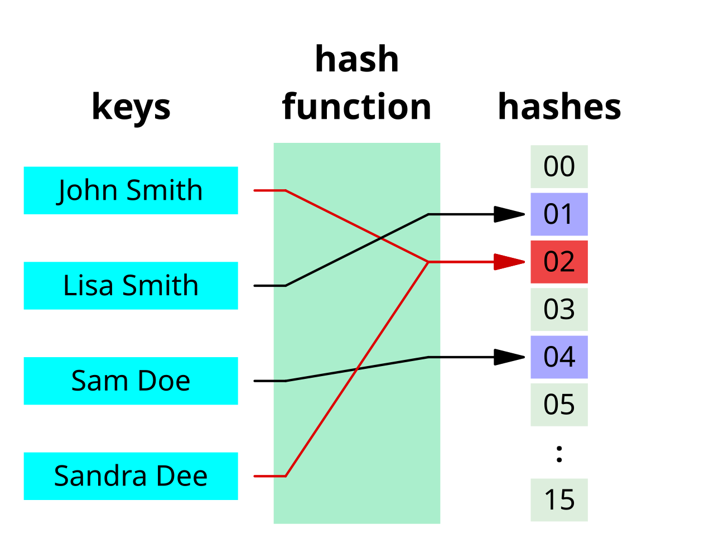
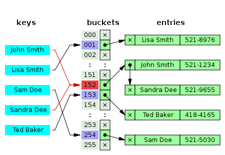
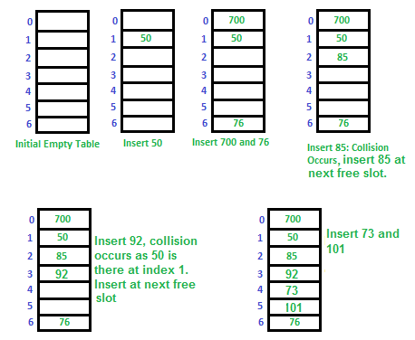

# 해시(hash)

## 🔹 해시 함수(hash function)

**해시 함수(hash function)** 란 임의의 길이의 데이터를 고정된 길이의 데이터로 매핑하는 함수입니다. 

- 매핑 전 원본 데이터는 키(key)
- 매핑 후 결과 값은 해시 값(hash value) 또는 해시(hash)

## 🔹 해시 테이블(hash table)

**해시 테이블(hash table)** 은 해시 값(hash value)을 **색인(index)** 으로 사용해 값을 빠르게 저장하거나 조회할 수 있습니다.

- 데이터가 저장 되는 곳을 버킷(bucket) 혹은 슬롯(slot)

 
출처: [ratsgo님의 블로그](https://ratsgo.github.io/data%20structure&algorithm/2017/10/25/hash/)

위 예시 그림 기준으로 버킷에 저장되는 데이터는 아래와 같습니다.
|index|data (key, value)|
|--|--|
|01|(Lisa Smith, 521-8976)|
|02|(Jhon Smith, 521-1234)|
|..|..|
|14|(Sandra Dee, 521-9655)|
|..|..|

## 🔹 해시 충돌(hash collision)

해시 함수(hash function)는 일반적으로 해시 값의 개수보다 훨씬 더 많은 키 값들을 처리하게 됩니다. 이때, 서로 다른 키들이 동일한 해시 값으로 매핑되는 현상을 **해시 충돌(hash collision)** 이라고 합니다.

 
출처: [ratsgo님의 블로그](https://ratsgo.github.io/data%20structure&algorithm/2017/10/25/hash/)

예시의 해시함수는 ‘John Smith’와 ‘Sandra Dee’를 모두 ‘02’로 매핑해 해시충돌을 일으키고 있습니다.

## 🔹 해시 충돌 해결 방안

### 1. Chaining
같은 색인(index)에 여러 데이터를 연결 리스트(linked list) 형태로 저장하는 방식입니다. 충돌이 발생해도 해당 버킷에 여러 값을 이어서 보관할 수 있습니다.
- 장점 : 삽입/삭제가 유연함
- 단점 : 포인터 공간 추가 필요 및 캐시 적중률이 낮음

 
출처: [ratsgo님의 블로그](https://ratsgo.github.io/data%20structure&algorithm/2017/10/25/hash/)

### 2. Open Addressing
충돌이 발생하면 빈 슬롯을 찾아 다른 위치에 저장하는 방식이며, `선형 탐사(Linear Probing)`, `제곱 탐사(Quadratic Probing)`, `이중 해싱(Double Hashing)` 등이 있습니다.
- 장점 : 공간 효율이 좋음
- 단점 : 삭제가 어렵고 클러스터링 발생의 가능성이 있음

 
출처: [ratsgo님의 블로그](https://ratsgo.github.io/data%20structure&algorithm/2017/10/25/hash/)

## ✨ 출처

[위키백과](https://ko.wikipedia.org/wiki/%ED%95%B4%EC%8B%9C_%ED%95%A8%EC%88%98)
[ratsgo 님의 블로그](https://www.inflearn.com/course/%EC%95%8C%EA%B3%A0%EB%A6%AC%EC%A6%98-%EA%B0%95%EC%A2%8C/)
