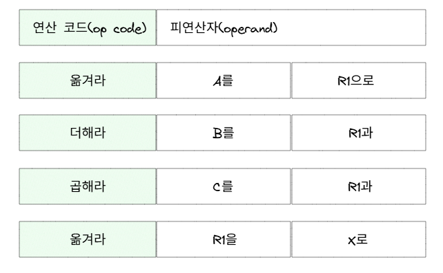
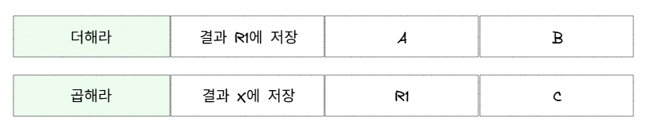
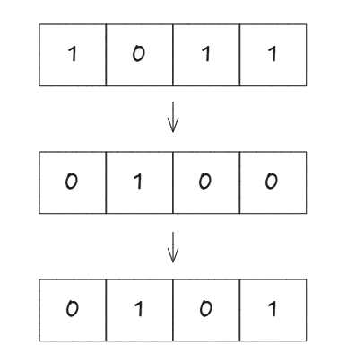
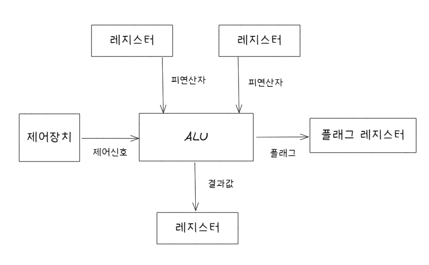
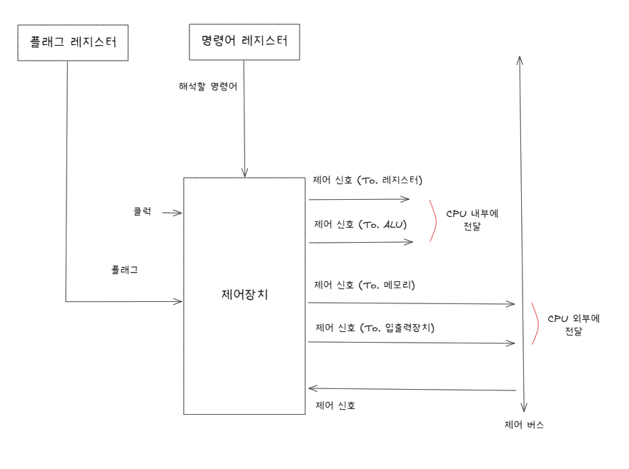
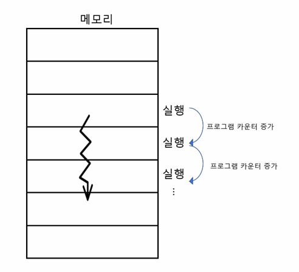
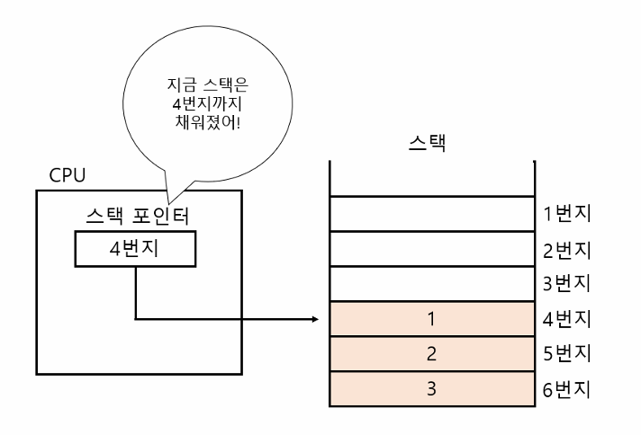
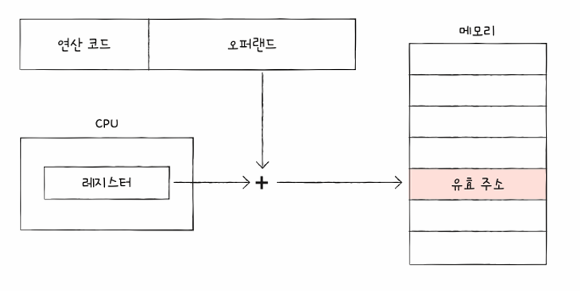
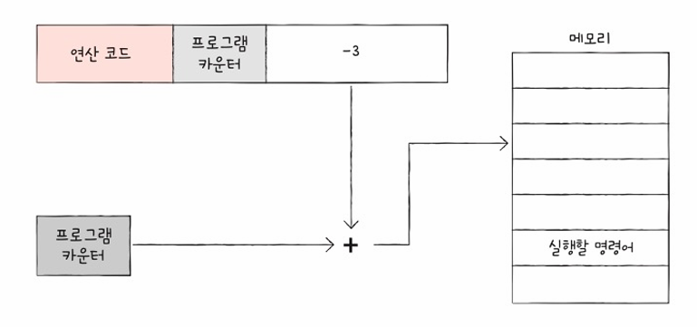
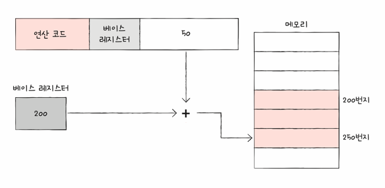

## 목차

<!-- TOC -->

- [1. 명령어](#1-명령어)
  - [1.1 고급 언어에서 저급 언어로 어떻게 변환할까?](#11-고급-언어에서-저급-언어로-어떻게-변환할까)
  - [1.2 컴퓨터가 이해하는 명령어는 무엇일까?](#12-컴퓨터가-이해하는-명령어는-무엇일까)
  - [1.3 주요 명령어 연산 코드](#13-주요-명령어-연산-코드)
  - [명령어 예시](#명령어-예시)

- [2. 유효주소](#2-유효-주소)
  - [2.1 주소 지정 방식의 종류](#21-주소-지정-방식의-종류)

- [3. 데이터](#3-데이터)
  - [3.1 이진수 (Binary)](#31-이진수-binary)
  - [3.2 2의 보수 (Two's Complement)](#32-2의-보수-twos-complement)
  - [3.3 부동 소수점 (Floating Point)](#33-부동-소수점-floating-point)
  - [3.4 문자 인코딩 (Character Encoding)](#34-문자-인코딩-character-encoding)

- [4. CPU](#4-cpu)
  - [4.1 CPU 구성 요소](#41-cpu-구성-요소)
  - [4.2 ALU](#42-alu)
  - [4.3 제어 장치](#43-제어-장치)

- [5. 레지스터](#5-레지스터)
  - [5.1 프로그램 카운터(PC)](#51-프로그램-카운터pc)
  - [5.2 명령어 레지스터(IR)](#52-명령어-레지스터ir)
  - [5.3 메모리 주소 레지스터(MAR)](#53-메모리-주소-레지스터mar)
  - [5.4 메모리 버퍼 레지스터(MBR)](#54-메모리-버퍼-레지스터mbr)
  - [5.5 플래그 레지스터](#55-플래그-레지스터)
  - [5.6 범용 레지스터](#56-범용-레지스터)
  - [5.7 스택 포인터(SP)](#57-스택-포인터sp)
  - [5.8 베이스 레지스터](#58-베이스-레지스터)

<!-- /TOC -->

## 1. 명령어

- 컴퓨터는 명령어를 통해 동작합니다.
- 명령어는 컴퓨터가 직접 이해할 수 있는 **저급 언어** 입니다.
- 우리가 작성하는 소스 코드는 사람이 이해하기 쉬운 **고급 언어** 입니다.
- 따라서 **소스 코드는 실행 전에 명령어로 변환**되어야 하며, 이 과정을 통해 컴퓨터가 이해하고 실행할 수 있습니다.

### 1.1 고급 언어에서 저급 언어로 어떻게 변환할까?

|방식|설명|예시|
|--|--|--|
|컴파일|전체 소스를 한번에 목적 코드로 변환|C/C++, Java|
|인터프리트|한 줄씩 목적 코드로 변환| JavaScript, Python|

### 1.2 컴퓨터가 이해하는 명령어는 무엇일까?

- 명령어는 보통 "**무엇을 대상으로, 어떤 동작을 수행하라**"는 형태로 구성됩니다.
  - 여기서 대상은 `오퍼랜드(operand)` 라고 하며,
  - 수행할 동작은 `연산코드(op code)` 라고 합니다.
- 즉, 명령어는 "**오퍼랜드로 연산코드를 수행하라**"는 의미가 됩니다.

> #### 📘 TIP
> 
> **오퍼랜드(operand)** 는 대상이 직접적으로 명시되기도 하지만, 명령어의 길이가 한정되어 있기 때문에, 대상의 주소가 명시되기도 합니다.
>

### 1.3 주요 명령어 연산 코드

#### 데이터 전송

|연산 코드|설명|
|--|--|
|MOVE|데이터를 옮겨라|
|STORE|메모리에 저장해라|
|LOAD|메모리에서 가져와라|
|PUSH|스택에 저장해라|
|POP|스택에서 꺼내라|

#### 산술 및 논리 연산

|연산 코드|설명|
|--|--|
|ADD/SUB/MUL/DIV|산술 연산|
|INC/DEC|증가/감소|
|AND/OR/NOT|논리 연산|
|COMPARE|값 비교|

#### 제어 흐름

|연산 코드|설명|
|--|--|
|JUMP|특정 주소로 실행 순서를 옮겨라|
|COND JUMP|조건을 만족하면 특정 주소로 실행 순서를 옮겨라|
|HALT|프로그램 실행을 정지하라|
|CALL|되돌아올 주소를 저장한 채 특정 주소로 실행 순서를 옮겨라|
|RETURN|CALL 호출 시 지정했던 주소로 돌아가라|

#### 입/출력 제어

|연산 코드|설명|
|--|--|
|READ|입출력 장치로부터 데이터를 읽어라|
|WRITE|입출력 장치로부터 데이터를 써라|
|START IO|입출력 장치를 시작해라|
|TEST IO|입출력 장치의 상태를 확인해라|

### 명령어 예시

다음은 *x = (a + b) * c*를 계산하는 명령어의 시나리오를 예시입니다.

**시나리오 A**

 

1. 메모리의 A번지 값을 연산을 진행할 레지스트리 R1으로 옮깁니다.
2. 메모리의 B번지 값을 R1에 더합니다.
3. 메모리의 C번지 값을 R1에 곱합니다.
4. 계산이 종료된 R1의 값을 메모리 X번지로 이동시킵니다.

**시나리오 B**

 

1. 메모리의 A번지와 B번지 값을 더해 레지스터 R1에 저장합니다.
2. 메모리의 C번지 값을 R1과 곱해 메모리 X번지에 저장합니다.

---

## 2. 유효 주소

- 연산의 대상 데이터가 위치한 **실제 주소** 입니다.
- 그리고, 연산 주소를 찾는 방식을 **주소 지정 방식** 이라고 합니다.

### 2.1 주소 지정 방식의 종류

#### 즉시 주소 지정

- 오퍼랜드 필드에 **직접 데이터 값을 명시** 합니다.   
- 가장 빠른 주소 지정이지만, 데이터 크기에 제한이 있습니다.

#### 직접 주소 지정

- 오퍼랜드 필드에 **유효 주소를 명시** 합니다.   
- 오퍼랜드 필드로 표현 가능한 메모리 주소 크기만큼 제한이 있습니다.

#### 간접 주소 지정

- 오퍼랜드 필드에 **유효 주소가 저장된 주소를 명시** 합니다.   
- 느리지만 크기의 제약이 없습니다.

#### 레지스트리 주소 지정

- 오퍼랜드 필드에 **레지스터를 직접 명시** 합니다.   
- *CPU가 레지스터 접근 속도 > CPU가 메모리 접근 속도*

#### 레지스트리 간접 주소 지정

- **유효 주소를 저장한 레지스터를 명시** 합니다.   
- 메모리 접근을 한번만 수행합니다.

---

## 3. 데이터

- 컴퓨터는 오직 `0`과 `1`만 이해할 수 있기 때문에, 우리가 사용하는 모든 데이터는 이진수 형태로 바뀌어 저장됩니다.
- 이때 각 데이터의 종류에 따라 다음과 같은 방식으로 표현됩니다:
  - **양수**는 **이진수(Binary)** 로 표현됩니다.
  - **음수**는 **2의 보수(Two’s Complement)** 방식으로 표현합니다.
  - **소수**는 **부동 소수점(Floating Point)** 방식으로 표현합니다.
  - **문자**는 **문자 집합**에 따라 정해진 숫자로 바꾼 뒤, **인코딩(Character Encoding)** 방식으로 저장합니다.

### 3.1 이진수 (Binary)

- 이진수는 `0`과 `1`로 수를 표현합니다.
- **1을 넘어가면 자릿수를 올려 표현**하며, 각 자릿수는 **2의 거듭제곱** 을 의미합니다.

ex. 십진수를 이진수로 변환

|십진수|이진수|
|--|--|
|1|1|
|2|10|
|3|11|
|4|100|
|5|101|
|6|110|
|7|111|
|8|1000|

이진수는 숫자가 커질수록 **bit 수가 길어지므로** **16진수** 를 사용하여 가독성을 높이기도 합니다.

### 3.2 2의 보수 (Two's Complement)

- 컴퓨터는 음수를 **2의 보수** 로 표현합니다.  
- **모든 비트를 반전하고 +1을 더하면 음수** 가 됩니다.

ex. 1011을 음수로 표현

 

1. 모든 0과 1을 뒤집습니다.
2. 1을 더합니다.

> #### 📘 TIP
>
> 플래그 (Flag)
> CPU는 연산 과정에서 **음수 플래그(Negative Flag)** 를 설정합니다.  
> 연산 결과에 따라 **CPU가 해당 값을 양수 또는 음수로 해석** 할 수 있습니다.

### 3.3 부동 소수점 (Floating Point)

- 소수점이 포함된 실수는 **부동 소수점** 방식으로 표현됩니다.  
- 형태: `m x 2^n`
  - 유효 숫자 부분를 나타내는 **가수** (m)
  - 이동한 자리 수를 나타내는 **지수** (2^n)
  - 지수 표현을 위해 더하는 기본값인 **바이어스**
    - `2^(k-1) - 1`, k: 지수 비트 수

ex. 부동 소수점 표현

- `1101011.1010101` → `1.1010111010101 × 2^6`
- `110101110.10101` → `1.1010111010101 × 2^-2`

> #### 💡 부동 소수점의 문제점
> 
> 일부 소수는 **2진수로 정확히 표현할 수 없습니다.**   
> ex. `1/3` → 10진수에서는 `0.3333...`
>
> 예를 들어 0.1이나 0.2 같은 값은 2진수로 바꾸면 **무한히 반복되는 소수가 되기 때문에** 컴퓨터는 이를 일정한 비트 수 안에 근사값으로만 저장하게 됩니다.   
> 이 과정에서 아주 작은 오차가 발생하고, 그 결과로 **0.1 + 0.2 != 0.3** 가 될 수 있습니다.

### 3.4 문자 인코딩 (Character Encoding)

- 컴퓨터는 문자를 숫자로 변환해 저장하며, 이를 **문자 인코딩** 이라 합니다.
  - 문자 집합: 표현 가능한 문자들의 모음
  - 문자 인코딩: 문자를 `0`과 `1`(이진수)로 변환하는 과정
  - 문자 디코딩: 이진수를 다시 문자로 변환하는 과정

#### 아스키 코드 (ASCII Code)

- 초기 문자 인코딩 방식으로 알파벳, 숫자, 제어문자 등을 포함합니다.   

#### 유니코드 (Unicode)

- 거의 모든 문자를 표현 가능합니다. (한글, 이모지, 특수문자 등)
  - 유니코드 코드 포인트: 각 문자에 고유 번호를 부여
  - 인코딩 방식: `UTF-8` `UTF-16` `UTF-32` 

---

## 4. CPU

### 4.1 CPU 구성 요소

|구성 요소|역할|
|--|--|
|ALU (산술논리연산장치)|연산을 수행 (계산, 논리 연산 등)|
|제어 장치|명령어를 해석하고 제어 신호 전달|
|레지스터|연산 중 데이터를 임시로 저장|

 

### 4.2 ALU

- **연산 대상(피연산자)**를 레지스터에서 받아옵니다.
- **제어 장치의 제어 신호**를 받아 어떤 연산을 수행할지 결정합니다.
- **결과는 레지스터에 저장**되며, **플래그 레지스터에 부가 정보도 저장**합니다.

### 4.3 제어 장치

- 명령어를 해석하고, 시스템 버스를 통해 제어 신호를 각 장치로 전달합니다.
 

**제어 흐름**
1. **플래그 레지스**터 값을 참조합니다.
2. **명령어 레지스터**로 명령어를 해석합니다.
3. 해석한 명령어 기반으로 **시스템 버스**에 제어 신호를 전달합니다.

> #### 📘 시스템 버스란?
>
> 컴퓨터의 4가지 핵심부품이 서로 정보를 주고받을 수 있게해주는 통로입니다.
> - 데이터 버스 : 실제 데이터를 전달합니다.
> - 주소 버스 : 데이터를 주고받을 주소를 전달합니다.
> - 제어 버스 : 어떤 동작을 수행할지 신호를 전달합니다.
>

## 5. 레지스터

- CPU 내에서 사용되는 매우 빠른 임시 저장장치입니다.

### 5.1 프로그램 카운터(PC)

- 다음에 실행할 명령어의 메모리 주소를 저장합니다.
- 일반적으로 1씩 증가하지만, 특별한 경우(JUMP, 인터럽트 등)에는 해당 동작을 수행합니다.
 

### 5.2 명령어 레지스터(IR)

- 메모리에서 가져온 명령어를 저장합니다.

### 5.3 메모리 주소 레지스터(MAR)

- 읽거나 쓸 메모리의 주소를 저장합니다.

### 5.4 메모리 버퍼 레지스터(MBR)

- 메모리에서 주고 받는 데이터를 저장합니다.

### 5.5 플래그 레지스터

- 연산의 결과에 대한 부가 정보를 저장합니다.

|종류|설명|
|--|--|
|부호 플래그|연산 결과의 부호(양수, 음수)를 나타냅니다.|
|제로 플래그|연산 결과가 0인지 여부를 나타냅니다.|
|캐리 플래그|연산 결과가 올림수나 빌림수가 발생했는지 여부를 나타냅니다.|
|오버플로우 플래그|오버플로 발생 여부를 나타냅니다.|
|인터럽트 플래그|인터럽트가 가능 여부를 나타냅니다.|
|슈퍼바이저 플래그|커널 모드로 실행 중인지, 사용자 모드로 실행 중인지를 나타냅니다.|

### 5.6 범용 레지스터

- 범용적으로 사용 가능한 레지스터입니다.

### 5.7 스택 포인터(SP)

- 스택에서 현재 위치를 가리키는 레지스터 입니다.
 

### 5.8 베이스 레지스터

- 변위 주소 계산 시 기준 주소로 사용되는 레지스터입니다.

> #### 📘 변위 주소 지정 방식이란?
>
> 오퍼랜드 필드의 값을 변위 삼아, 특정 레지스터 값을 더해 유효 주소를 얻는 주소 지정입니다.
>  
>
> 상대 주소 지정
> - 오퍼랜드에 **프로그램 카운터** 값을 더해 주소를 지정합니다.
>  
>
> 베이스 레지스터 주소 지정
> - 오퍼랜드에 **베이스 레지스터** 값을 더해 주소를 지정합니다.
>  
>
