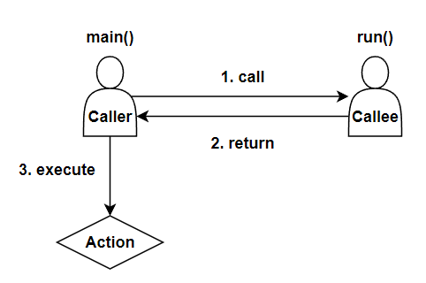
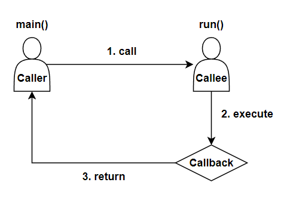
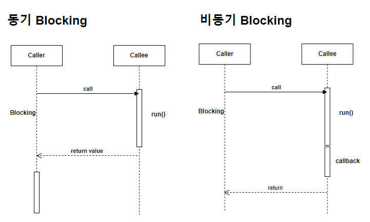
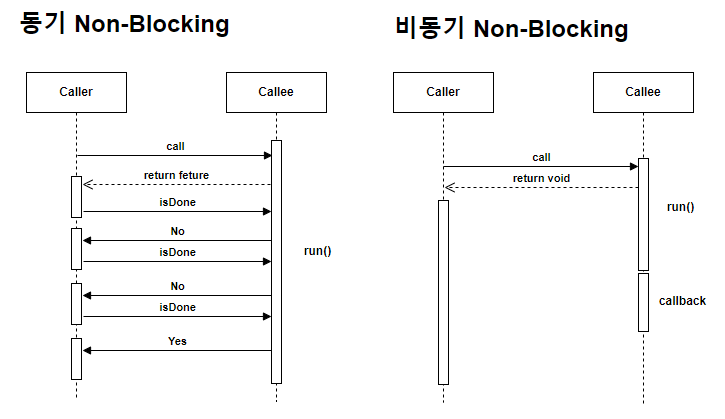

## 반응형 프로그래밍(Reactive Programming)
데이터 스트림이나 변경 사항에 대해 반응적으로 동작하는 프로그래밍 패러다임입니다.

### 함수형 인터페이스
단일 추상 메소드(Single Abstract Method, SAM)를 가진 인터페이스를 말합니다. 함수형 인터페이스는 주로 람다 표현식과 함께 사용되며, 람다 표현식은 이 단일 추상 메소드의 구현체로 쓰일 수 있습니다.

    @FunctionalInterface
    public interface Runnable {
        public abstract void run();
    }

### 함수 관점에서 동기와 비동기
동기는 `Caller`가 `Callee`의 결과에 관심이 있으며, `Caller`는 결과를 이용해 `Action`을 수행합니다.

비동기는 `Caller`가 `Callee`의 결과에 관심이 없으며, `Callee`는 결과를 이용해 `Callback`을 수행합니다.

### 함수 관점에서 blocking과 non-blocking
Blocking은 `Caller`가 `Callee`를 호출한 후 작업이 완료될 때까지 다음 작업으로 진행하지 않고 대기하는 것을 의미합니다.

Non-Blocking은 `Callee`를 호출한 후 작업이 완료되지 않더라도 `Caller`는 본인의 일을 할 수 있습니다.

 

### 📚 참고
* [FastCampus] Spring Webflux 완전 정복 : 코루틴부터 리액티브 MSA 프로젝트까지

