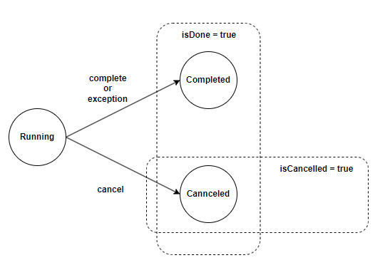

## Future 인터페이스
자바에서 비동기적인 작업의 결과를 나타내기 위한 인터페이스입니다.

```java
public interface Future<V> {
    // 작업을 취소합니다. 인자에 false를 주면, 시작하지 않은 작업에 대해서만 취소를 합니다.
    // 취소할 수 없는 상황이라면, false를 반환합니다.
    boolean cancel(boolean mayInterruptIfRunning);
    
    // 작업이 명시적으로 취소된 경우 true를 반환합니다.
    boolean isCancelled();
    
    // 작업이 완료되었다면, 원인과 상관없이 true를 반환합니다.
    boolean isDone();
    
    // 결과를 반환합니다. 
    // 결과를 구할 때까지 thread가 blocking 상태를 유지합니다.
    V get() throws InterruptedException, ExecutionException;

    // 결과를 반환합니다. 
    // 결과를 구할 때까지 timeout 동안 thread가 blocking 상태를 유지합니다.
    V get(long timeout, TimeUnit unit) 
            throws InterruptedException, ExecutionException, TimeoutException;
}
```

### Future isDone()과 isCancelled()


## ExecutorService
- 자바에서 멀티스레딩을 지원하며 쓰레드 풀을 관리하는 인터페이스입니다.
- 쓰레드의 생명주기를 관리하고 작업을 스케줄링하는 등의 작업을 간편하게 처리할 수 있도록 설계되어 있습니다.

### ExecutorService 주요 메서드

```java
public interface ExecutorService extends Executor {
    // Runnable 인터페이스를 구현한 작업을 쓰레드 풀에서 비동기적으로 실행
    void execute(Runnable command);

    // Callable 인터페이스를 구현한 작업을 쓰레드 풀에서 비동기적으로 실행하고,
    // 작업 결과를 Future<T> 객체로 반환
    <T> Future<T> submit(Callable<T> task);
    
    // ExecutorService를 종료하여 더 이상 새로운 작업을 받지 않습니다.
    void shutdown();
}
```

## Executors
- 자바에서 쓰레드 풀을 생성하는 팩토리 메소드들을 제공하는 유틸리티 클래스입니다.
- `ExecutorService`의 구현체를 생성하거나 특정한 종류의 쓰레드 풀을 손쉽게 생성할 수 있도록 도와줍니다.
- `Executors` 클래스에서 제공되는 주요 팩토리 메소드들은 다음과 같습니다
  - `newSingleThreadExecutor()` : 단일 쓰레드로 구성된 쓰레드 풀을 생성하며, 작업이 순차적으로 실행됩니다.
  - `newFixedThreadPool(int nThreads)` : 고정된 크기의 쓰레드 풀을 생성하며, 지정된 수의 쓰레드가 동시에 실행됩니다.
  - `newCachedThreadPool()` : 필요에 따라 쓰레드를 생성 및 재사용하고 일정 시간 사용하지 않으면 회수합니다. 
  - `newScheduledThreadPool(int corePoolSize)` : 지정된 수의 코어 쓰레드를 가지는 스케줄링 기능을 갖춘 쓰레드 풀을 생성합니다. 주기적이거나 지연이 발생하는 작업을 실행합니다.
  - `newWorkStealingPool()` : work steal 알고리즘을 사용하는 ForkJoinPool을 생성합니다.

```java
// 새로운 쓰레드를 생성하여 1을 반환
public static Future<Integer> getFuture() {
    var executor = Executors.newSingleThreadExecutor();
    try {
        return executor.submit(() -> 1);
    } finally {
        executor.shutdown();
    }
}

// 새로운 쓰레드를 생성하고 1초 대기 후 1을 반환
public static Future<Integer> getFutureCompleteAfter1s() {
  var executor = Executors.newSingleThreadExecutor();
  try {
    return executor.submit(() -> {
        Thread.sleep(1000);
        return 1;
    });
  } finally {
    executor.shutdown();
  }
}
```

## Future 인터페이스의 한계
- `cancel()`을 제외하고 외부에서 제어할 수 없습니다.
- 반환된 결과를 `get()`을 통해 접근하기 때문에 비동기 처리가 어렵습니다.
- 완료되거나 에러가 발생했는지의 상태 구분이 어렵습니다.


## 📚 참고
* [FastCampus] Spring Webflux 완전 정복 : 코루틴부터 리액티브 MSA 프로젝트까지
