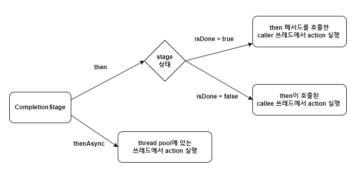

## CompletionStage 인터페이스
자바에서 비동기 계산의 결과를 다루기 위한 인터페이스이며, `Future`를 확장하고 더 많은 기능을 제공합니다.

```java
public interface CompletionStage<T> {
    // 비동기 작업이 완료된 후에 결과를 가공하는 데 사용됩니다.
    <U> CompletionStage<U> thenApply(Function<? super T,? extends U> fn);
    <U> CompletionStage<U> thenApplyAsync(Function<? super T,? extends U> fn);
    
    // 비동기 작업이 완료된 후에 결과를 소비하는 데 사용됩니다. 반환 값이 없는 소비 작업에 유용합니다. 
    CompletionStage<Void> thenAccept(Comsumer<? super T> action);
    CompletionStage<Void> thenAcceptAsync(Comsumer<? super T> action);

    // 비동기 작업이 완료된 후에 어떤 동작을 실행하는 데 사용됩니다. 반환 값이 없는 작업에 유용합니다.
    CompletionStage<Void> thenRun(Runnable action);
    CompletionStage<Void> thenRunAsync(Runnable action);
    
    // 두 개의 CompletionStage를 연결하고, 첫 번째 작업의 결과를 사용하여 두 번째 작업을 생성하는 데 사용됩니다.
    <U> CompletionStage<U> thenCompose(Function<? super T, ? extends CompletionStage<U>> fn);
    <U> CompletionStage<U> thenComposeAsync(Function<? super T, ? extends CompletionStage<U>> fn);
    
    // 예외가 발생했을 때 대체 값을 제공하는 데 사용됩니다.
    CompletionStage<T> exceptionally(Function<Throwable, ? extends T> fn);
}
```

### ForkJoinPool
`CompletableFuture`는 내부적으로 비동기 함수들을 실행하기 위해 `ForkJoinPool`을 사용합니다.
`ForkJoinPool`은 task를 fork를 통해 subtask로 나누고 Thread pool에서 steal work 알고리즘을 이용해 균등하게 처리하여 join을 통해 결과를 생성합니다.

### CompletionStage 메서드의 then과 thenAsync의 차이



## CompletableFuture 클래스
`CompletionStage` 인터페이스를 구현한 클래스입니다.

```java
public interface CompletionStage<T> {
    // 비동기 작업이 완료되면 결과에 함수를 적용하고 새로운 CompletableFuture를 반환합니다.
    static <U> CompletableFuture<U> supplyAsync(Supplier<U> supplier) {}
    
    // 비동기 작업이 완료되면 특정 동작을 비동기적으로 수행하는 CompletableFuture를 반환합니다.
    static CompletableFuture<Void> runAsync(Runnable runnable) {}
    
    // 비동기 작업이 완료되지 않았다면, 주어진 값으로 채우며, 완료 상태로 만듭니다.
    boolean complete(T value) {}
    
    // 작업이 예외로 완료되었는지 여부를 확인합니다.
    boolean isCompletedExceptionally() {}
    
    // 주어진 여러 비동기 작업들이 모두 완료될 때까지 대기하는 새로운 CompletableFuture를 반환합니다.
    static CompletableFuture<Void> allOf(CompletableFuture<?>... cfs) {}

    // 주어진 여러 비동기 작업 중 하나라도 완료되면 해당 결과로 완료된 새로운 CompletableFuture를 반환합니다.
    static CompletableFuture<Object> anyOf(CompletableFuture<?>... cfs) {}
}
```
